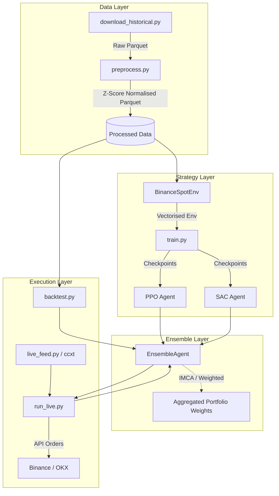

# FinRL-X Multi-Asset Portfolio Trading System
## System Architecture & Project Documentation

This repository implements an automated, Reinforcement Learning-based (FinRL-X) trading system for managing a multi-asset cryptocurrency spot portfolio (BTC and ETH) quoted in USDT. 

This document serves as the primary architectural reference for quantitative developers and researchers joining the project, detailing the data pipelines, environment mechanics, algorithmic ensemble logic, and the execution lifecycle.

---

## Table of Contents
1. [System Architecture Overview](#1-system-architecture-overview)
2. [Directory Structure](#2-directory-structure)
3. [Data Pipeline Layer](#3-data-pipeline-layer)
4. [Reinforcement Learning Models & Ensemble Agent](#4-rl-models--ensemble-agent)
5. [Environment Architecture (`BinanceSpotEnv`)](#5-environment-architecture-binancespotenv)
6. [Execution Lifecycle & CLI Commands](#6-execution-lifecycle--cli-commands)

---

## 1. System Architecture Overview

The system uses a modular approach separating data engineering, agent policies, environment simulation, and live broker execution.



---

## 2. Directory Structure

- **`agents/`**: Contains the logic combining individual trained RL models into cohesive trading policies (e.g., `ensemble_agent.py`).
- **`data/`**: The entire ETL pipeline logic (`download_historical.py`, `preprocess.py`, `live_feed.py`) and directories for `raw/` and `processed/` parquet files.
- **`environment/`**: Contains `trading_env.py` - the Gymnasium-compatible environment containing the multi-objective reward function, hardcoded logic, and constraints.
- **`logs/`**: Monitor files (CSV), Tensorboard event logs orchestrating the training progression.
- **`metrics/`**: Evaluation logic mapping equity curves, Trade Counts, Sharpe/Sortino ratios, and Plotly visualization logic (`performance.py`).
- **`models/`**: State dictionary dumps (`.zip` format) for stable-baselines3 agents (A2C, DDPG, PPO, SAC).
- **`scripts/`**: (Or root) Operational endpoints for the user: `train.py`, `backtest.py`, `run_live.py`.

---

## 3. Data Pipeline Layer

The data pipeline guarantees that the execution layer and the training layer see mathematically identical features, strictly guarding against look-ahead bias.

### `download_historical.py`
Retrieves bulk OHLCV monthly ZIP archives from Binance's public data portal (`data.binance.vision`). 
- Escapes heavy REST API rate limiting.
- Converts timestamps securely into millisecond epoch UTC indexes.
- Outputs raw Multi-Timeframe (MTF) Dataframes into `/data/raw/` in `.parquet` format for extreme I/O speed.

### `preprocess.py`
Handles feature engineering, indicator generation, and stationary normalisation.
- **Technical Indicators**: RSI, MACD, EMA bundles, ATR, Bollinger Band Widths, and OBV (On-Balance-Volume).
- **ICT Concepts**: Calculates Fair Value Gaps (FVG) and short-term Liquidity Sweeps normalised against price.
- **MTF Merging & Look-ahead Prevention**: Higher timeframe data (e.g. 4H, 1D) is aggregated onto the base interval (1H) using `pd.merge_asof(direction="backward")`. Furthermore, HTF data is artificially `.shift(1)` delayed to ensure an agent predicting at `09:00` cannot see the `12:00` daily close.
- **Stationarity**: Numeric signals undergo a rolling Z-Score standardisation matching roughly 10 lookback windows so inputs have zero mean and unit variance.

### `live_feed.py`
*Note: In the current repository state, live state fetching is handled inherently via `CCXTBroker.fetch_state()` inside `run_live.py*`. If `live_feed.py` implements native WebSockets for deeper tick-level metrics bypassing REST, it requires further documentation on its interfacing mechanism.

---

## 4. RL Models & Ensemble Agent

We utilise continuous action-space algorithms from `stable-baselines3`.

### Base Algorithms
1. **PPO (Proximal Policy Optimization)**: On-policy, stable, and highly tuned for predictable continuous space mappings. Requires massive parallelization (`SubprocVecEnv`) and a large `2_000_000` timestep budget for efficient convergence.
2. **SAC (Soft Actor-Critic)**: Off-policy algorithm optimising stochastic policies using an entropy bonus to encourage broad state-space exploration. Highly sample efficient (`300_000` timesteps via Replay Buffers).

*(Note: While `A2C` and `DDPG` directories exist in the `logs/` tree, `config.py` enforces PPO/SAC as the active core algorithms).*

### The Ensemble Agent (`agents/ensemble_agent.py`)
Combines predictions from PPO and SAC to issue final portfolio weights `[BTC, ETH, USDT]`. 
It implements multiple combination methods:
- `mean` and `voting`: Simple averaging / categorical voting.
- `weighted`: Static validation Sharpe ratio weighting.
- `dynamic_weighted`: Periodically adjusts influence based on a trailing 7-day rolling Sharpe.
- **`imca` (Iterative Model Combining Algorithm)**: A regime-aware router. Evaluates current market volatility (Bollinger Band width Z-scores) and macro trend (BTC distance from 200 SMA). For instance, in whipsaw low-trend regimens, it routes influence heavily toward the off-policy SAC adapter; in confirmed trends, PPO's structural trend-following weight is increased.

---

## 5. Environment Architecture (`BinanceSpotEnv`)

The `Gymnasium` environment simulates the portfolio across history while heavily penalising non-economic behavior.

### Observation & Action Spaces
- **Observation Space**: A flattened window (`LOOKBACK_WINDOW = 30`) of all symbol features, appended with current portfolio weights. The target `log_return` used for reward generation is deliberately detached from this array to block data leakage.
- **Action Space (`Box([-1, 1])`)**: For the two assets (`N_ASSETS = 2`). The continuous logits are mapped into positive bounds `[0, 1]` via an internal continuous target softmax.
- **Binance Spot Constraint**: The sum of requested weights defines asset allocation; $1 - \text{sum}(w)$ dictates the allocation to USDT (Cash). No synthetic shorting is possible.

### Multi-Objective Reward System
The composite reward function ($R_t$) directs the agent towards smooth compounding behavior via 4 linear weighted objectives:

1. **Profit ($w=1.0$)**: Log return computed *strictly after transaction fees*.
   - *Sortino Shaping Drop*: If the action results in negative equity flux, the penalty is dynamically multiplied by $2.5\times$ to strongly suppress downside capture.
2. **Drawdown ($w=10.0$ / $2.0$)**: Uses a 100-step rolling window high-water mark.
   - *Omega Ratio / CVaR Proxy*: The absolute drawdown value is **squared** (`dd^2 * 10`). This creates an exponential barrier: it ignores minor 1% localized noise but heavily penalizes 10%+ structural crashes.
3. **Turnover ($w=0.5$)**: Applies Binance trading fees and `SLIPPAGE` penalties to weight changes.
4. **Opportunity Cost ($w=1.5$)**: "Curing Turtling". During a confirmed macroeconomic uptrend ($>2\%$ distance from 1D SMA 200) where the agent is hiding in $>50\%$ cash, the step reward suffers a linear bleed rate scaled by the strength of the uptrend.

### Custom Interventions & Hardcoded Protections
- **Deadband Filter**: Setting `REBALANCE_THRESHOLD = 0.03`. If weight requests differ from the current state by less than 3%, the environment ignores the order. This stops the agent from bleeding capital on dust fees.
- **Dust-Trade Filter**: Fixes environment accounting by forcing simulated transaction fees to 0 if the traded USDT notional is lower than `MIN_ORDER_USDT` (10 USD).
- **Dynamic ATR Trailing Stops**: Tracks a synthetic price per asset. If drawdown from the local peak breaches `0.04 + ATR_Z * 0.01`, the environment *forces* mathematical liquidation of that asset into USDT overriding the agent policy.
- **Kill-Switch**: At $15\%$ Absolute Drawdown from execution start, the agent suffers heavily ($-5.0$ reward) and the episode aborts, bounding the state space.
- **Action Smoothing**: Employs Temporal Decay EMA (`alpha = 0.2`) on raw outputs during training to suppress erratic frame-by-frame asset flipping. Note: bypassed in live production via the `step_weights` path.

---

## 6. Execution Lifecycle & CLI Commands

### Phase 1: Data Preparation
Download history and compute ML indicators.
```bash
# Obtain raw ZIP historicals
python -m data.download_historical --start 2020-01-01 --end 2025-12-31

# Compute MTF indicators, Normalisation, and Parquet caching
python -m data.preprocess
```

### Phase 2: Training Base Agents
Train models using CPU/Vectorised environments.
```bash
# Train PPO and SAC according to budget config
python scripts/train.py --algo ALL

# Force a specific algorithm with specific step budget
python scripts/train.py --algo PPO --timesteps 1500000
```
*Outputs `best_model.zip` into `models/PPO/ppo_best.zip`.*

### Phase 3: Out-of-Sample Backtesting
Evaluate the combined ensemble on the test split.
```bash
# Evaluate using market-adaptive weights (IMCA regime detection)
python scripts/backtest.py --method imca

# Force arithmetic mean across model logits
python scripts/backtest.py --method mean
```

### Phase 4: Live / Testnet Execution
Executes the broker loop leveraging CCXT abstractions for OKX or Binance.
```bash
# Standard Testnet simulation
python scripts/run_live.py --exchange binance --mode testnet --method imca

# Run against production systems over REST API
python scripts/run_live.py --exchange binance --mode live --method imca

# Run in read-only / simulation layer
python scripts/run_live.py --exchange binance --mode live --dry-run
```
*Ensure `.env` contains `BINANCE_API_KEY`, `BINANCE_SECRET_KEY`, etc. Live script awakes natively once per hour (`REBALANCE_INTERVAL_SECS`) aligned with `KLINE_INTERVAL`.*