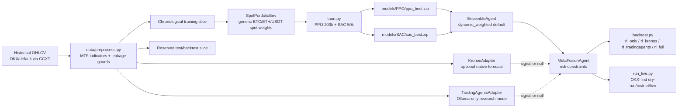
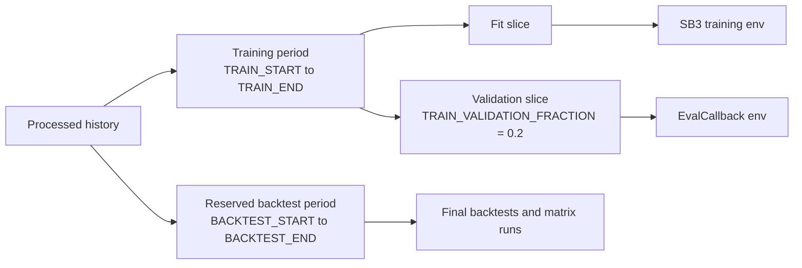

# BTC/ETH Trading Research Architecture

This repository is an OKX-first BTC/ETH spot allocation research system. The
core trading policy is a PPO/SAC reinforcement-learning ensemble. Kronos and
TradingAgents are optional overlays that may tilt the RL allocation, but missing
or failed overlays are no-ops. There is no heuristic trading fallback.

## Current Research Mode

- Primary exchange runtime: OKX via `run_live.py` / `scripts/run_live.py`.
- Active RL algorithms: PPO and SAC from Stable-Baselines3.
- Default ensemble method: `dynamic_weighted`.
- Default training budgets: PPO `200_000` steps, SAC `50_000` steps.
- TradingAgents provider chain: local Ollama only.
- Hosted ShopAI support remains dormant in code for later deployment, but it is
  not part of the research default and should not be called unless explicitly
  reconfigured.

## End-to-End Flow



## Repository Responsibilities

- `config.py`: central budgets, provider defaults, risk limits, paths, and live
  cadence.
- `data/download_historical.py`: downloads historical market data, defaulting to
  the configured exchange stack.
- `data/preprocess.py`: creates multi-timeframe feature parquet files with
  shifted higher-timeframe joins to reduce look-ahead leakage.
- `environment/trading_env.py`: defines `SpotPortfolioEnv`, a generic
  BTC/ETH/USDT spot portfolio environment used by training and backtesting.
- `train.py`: trains PPO/SAC, supports resume, deterministic seed plumbing, and
  chronological validation splitting.
- `agents/ensemble_agent.py`: combines PPO/SAC proposals. `dynamic_weighted` is
  the current serious evaluation default; `mean` and `weighted` remain useful
  baselines; `voting` and current `imca` are experimental until redesigned.
- `adapters/kronos_adapter.py`: optional Kronos forecast overlay. Native failure
  returns unavailable/no signal.
- `adapters/tradingagents_adapter.py`: optional multi-agent LLM overlay. Research
  mode uses only local Ollama and returns unavailable/no signal if Ollama fails.
- `agents/meta_fusion_agent.py`: applies optional overlay tilts and portfolio
  risk constraints; missing overlays do not tilt the RL allocation.
- `backtest.py`: runs single pipelines, ablation matrices, realism profiles, and
  RL diagnostics.
- `scripts/run_live.py`: canonical OKX-first execution loop. Root `run_live.py`
  is the compatibility entrypoint.

## Data Splits And Training Hygiene

The project uses chronological splits. Training-time model selection must not
use the final test/backtest period.



Current defaults in `config.py`:

- `TOTAL_TIMESTEPS["PPO"] = 200_000`
- `TOTAL_TIMESTEPS["SAC"] = 50_000`
- `TRAIN_VALIDATION_FRACTION = 0.2`
- `TRAIN_SEED = 42`

Resume training without overriding budgets:

```powershell
.\.venv\Scripts\python.exe train.py --algo ALL --resume --device auto --seed 42 --validation-fraction 0.2
```

`train.py` runs an automatic post-training backtest by default:

```powershell
.\.venv\Scripts\python.exe backtest.py --pipeline rl_only --realism-profile live_like --method dynamic_weighted
```

Use `--skip-backtest` when a training-only run is needed. The automatic
backtest can also be redirected with `--post-backtest-pipeline`,
`--post-backtest-realism-profile`, and `--post-backtest-method`.

## Ensemble And Fusion Behavior

`EnsembleAgent` produces PPO and SAC proposal weights plus a final RL ensemble
allocation. The default `dynamic_weighted` method adapts model influence from
recent model performance and produced the latest best RL-only candidate in the
current report artifacts.

`MetaFusionAgent` receives the RL allocation plus optional Kronos and
TradingAgents signals. If either overlay is unavailable, that overlay is skipped.
If all overlays are unavailable, the final target remains the RL allocation after
normal global constraints such as max asset weight, cash floor, and turnover cap.

## TradingAgents And Kronos Research Defaults

TradingAgents is configured for local-only research mode:

- `TRADINGAGENTS_PROVIDER = "ollama"`
- `TRADINGAGENTS_PROVIDER_FALLBACKS = ["ollama"]`
- `OLLAMA_BASE_URL = http://localhost:11434/v1` in `.env.example`
- `OLLAMA_MODEL = qwen3.5:4b` in `.env.example`

If Ollama is unavailable, TradingAgents records diagnostics and returns `None`.
It does not synthesize a heuristic trade. Kronos follows the same no-heuristic
contract: native init/inference failure returns unavailable/no signal.

## Backtest And Evaluation Commands

Pre-training checks:

```powershell
.\.venv\Scripts\python.exe -m unittest discover -s tests
.\.venv\Scripts\python.exe train.py --help
.\.venv\Scripts\python.exe backtest.py --help
```

RL-only dynamic weighted backtest:

```powershell
.\.venv\Scripts\python.exe backtest.py --pipeline rl_only --realism-profile live_like --method dynamic_weighted
```

Full ablation matrix with local Ollama-only overlay behavior:

```powershell
.\.venv\Scripts\python.exe backtest.py --run-matrix --realism-profile live_like --method dynamic_weighted
```

All-method ensemble comparison:

```powershell
.\.venv\Scripts\python.exe backtest.py --compare-ensemble-methods --realism-profile live_like
```

Useful outputs:

- `results/backtest_metrics.csv`
- `results/backtest_matrix_metrics.csv`
- `results/backtest_episode.parquet`
- `results/backtest_rl_diagnostics.csv`
- `results/backtest_ensemble_method_comparison.csv`
- `results/backtest_ensemble_method_comparison.png`
- `logs/tradingagents_decisions.jsonl`

## Live Execution

The root wrapper is the preferred operator entrypoint:

```powershell
.\.venv\Scripts\python.exe run_live.py --exchange okx --mode testnet --dry-run --method dynamic_weighted
```

Component toggles:

```powershell
.\.venv\Scripts\python.exe run_live.py --exchange okx --mode testnet --dry-run --enable-kronos --enable-tradingagents
.\.venv\Scripts\python.exe run_live.py --exchange okx --mode testnet --dry-run --disable-kronos --disable-tradingagents
```

Live safety remains strict: unavailable requested overlays stay visible in
diagnostics and safety reasons, but they do not inject fallback trades.

