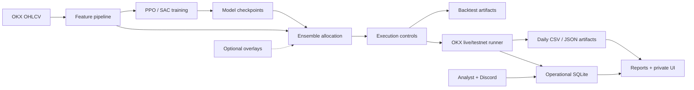

# Architecture

The system has two paths that share data and safety contracts: a research path
that trains/evaluates allocations and an operations path that observes or
executes them. Optional overlays can be absent without changing the base path.

```mermaid
flowchart LR
  market["OKX OHLCV"] --> features["Feature pipeline"]
  features --> train["PPO / SAC training"]
  train --> models["Model checkpoints"]
  models --> ensemble["Ensemble allocation"]
  features --> ensemble
  overlays["Optional overlays"] -.-> ensemble
  ensemble --> controls["Execution controls"]
  controls --> backtest["Backtest artifacts"]
  controls --> live["OKX live/testnet runner"]
  live --> artifacts["Daily CSV / JSON artifacts"]
  live --> database["Operational SQLite"]
  analyst["Analyst + Discord"] --> database
  artifacts --> reports["Reports + private UI"]
  database --> reports
```

## Module Map

| Module | Owns | Must not own |
| --- | --- | --- |
| `data` | download, features, chronological inputs | model selection |
| `environment` | portfolio transition and reward mechanics | exchange I/O |
| `agents` | RL proposals and ensemble/fusion logic | order submission |
| `risk` | portfolio and execution constraints | persistence |
| `tradingbot.execution` | OKX demo planning, confirmation, submission | model training |
| `tradingbot.analyst` | advisory LLM events and validation | autonomous orders |
| `tradingbot.storage` | schema migrations and mutable state | research artifacts |
| `tradingbot.runtime` | artifact/session mechanics | trading decisions |
| `tradingbot.reports` | summaries for CLI and UI | state mutation |
| `tradingbot.apps` | stable application entrypoints | domain implementation |

## Core Contracts

- Final test periods do not participate in training-time model selection.
- Missing overlays are no-ops and remain visible in diagnostics.
- Analyst output is advisory; only explicit confirmation can cross the execution seam.
- Mutable operational state is transactional; research evidence remains inspectable files.
- Root scripts are compatibility commands and should delegate into `tradingbot` over time.

## Current Architectural Debt

`train.py`, `backtest.py`, and `scripts/run_live.py` still contain large
orchestration implementations. New shared behavior belongs in a focused module
under `tradingbot`; wrappers should remain small. The next extraction with the
best leverage is shared execution-policy behavior across environment, backtest,
and live paths.

See [Operational persistence](architecture/persistence.md) for data ownership
and [Runtime spine](architecture/runtime_spine.md) for entrypoint migration.
