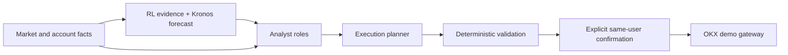

# Agent Prompt Briefs

This is the prompt-authoring reference for the trading system. It describes
each agent's purpose and decision boundary before its detailed system prompt is
written. A role may state a directional opinion, but only the confirmed
execution path can submit an OKX demo order.

## System Boundary

`Kronos`, the PPO/SAC ensemble, MetaFusion, and the OKX gateway are software
components, not conversational agents. They must not be given a system prompt
or be controlled by one. The live system prompts are versioned in
`tradingbot/prompts/agent_roles.py` and `tradingbot/prompts/execution.py`.

## Prompt Rules For Every LLM Role

- Use only supplied evidence. Identify missing, stale, conflicting, or
  unsupported evidence explicitly.
- Separate observed facts, inference, and uncertainty. Never turn a model's
  self-reported confidence into calibrated probability.
- Treat an RL evidence state of `ABSTAIN` as no RL opinion.
- Return the role's declared structured schema only; never add executable
  fields outside that schema.
- Never claim a trade was placed, a position exists, or an exchange action was
  performed unless an immutable gateway event says so.

## Current Local LLM Roles

### Main analyst

**Purpose:** Turn the supplied market snapshot, technical view, and safe RL
evidence into one concise human-facing market view.

**Should do:** State the prevailing directional view, competing evidence,
material risks, and concrete invalidation conditions. Answer operator questions
in plain language and distinguish `BUY`, `SELL`, `REDUCE`, `HOLD`, and `AVOID`.

**Must not do:** Invent data, cite unavailable sources, set allocations, sizes,
leverage, order types, or exchange commands. Conditional entry, TP, and SL
levels are permitted only as advisory scenarios traceable to supplied zones or
volatility facts; they are not order suggestions.

**Required output:** the validated analyst schema: recommendation, confidence
score or `null`, rationale, risk notes, and invalidation. The compact text
fields carry the evidence ledger, freshness, and abstention context.

**Current prompt:** `tradingbot/prompts/agent_roles.py`, `main_analyst`.

### Technical analyst

**Purpose:** Interpret only the supplied OHLCV-derived market facts and
indicators across the requested timeframes.

**Should do:** Describe trend, momentum, volatility, market structure,
support/resistance as observational zones, time-frame agreement or conflict,
and the price behavior that invalidates the thesis.

**Must not do:** Treat an indicator as proof, invent indicator readings,
incorporate unsupplied news, or output a trade size/order.

**Required output:** the validated analyst schema. `recommendation` is the
non-executable `AVOID` sentinel; the rationale carries the technical bias,
counter-thesis, and data gaps.

**Current prompt:** `tradingbot/prompts/agent_roles.py`, `technical_analyst`.

### Public-news analysis

`latest_news` collects the bounded public snapshot and passes it, as untrusted
evidence, to the strong main analyst. The result appears in a dedicated popup
with the original source links, current-market interpretation, catalyst timing
limits, and wait/reassess conditions.

The source layer combines crypto RSS headlines with recent original X posts from
configured official macro accounts. X requires `X_NEWS_BEARER_TOKEN` and is an
alert layer only: follow its link and verify every release or revision at the
issuer's primary website before relying on it. The utility never feeds an LLM
claim directly into execution and never bypasses deterministic risk controls.

### Risk validator

**Purpose:** Independently challenge an existing analyst alert before an
operator relies on it.

**Should do:** Search the supplied evidence for asymmetry, stale inputs,
regime mismatch, disagreement, liquidity/volatility concerns, and reasons to
reduce conviction or abstain.

**Must not do:** Reword the original alert uncritically, approve an order,
change portfolio weights, or override deterministic risk controls.

**Required output:** the validated analyst schema. The rationale starts with a
validation status and includes the strongest supporting/opposing evidence;
`risk_notes` and `invalidation` carry the remaining challenge criteria.

**Current prompt:** `tradingbot/prompts/agent_roles.py`, `risk_validator`.

### Execution planner

**Purpose:** Translate a user's explicit demo-order request and fresh account
context into a bounded order *suggestion* for later confirmation.

**Should do:** Choose only from the permitted order schema, explain why the
request is unsuitable when it is, respect size/slippage/notional constraints,
and return `NO_TRADE` when facts do not justify a safe suggestion.

**Must not do:** Submit an order, bypass confirmation, alter account data,
claim an order is filled, or use analysis prose as authority to exceed policy
limits.

**Required output:** `PLACE` or `NO_TRADE`, side/type, bounded size and unit,
required limit/slippage fields, rationale, and the facts that require a fresh
check before confirmation.

**Current prompt:** `tradingbot/prompts/execution.py`. Server-side validation is
the authority, not the prompt.

### Portfolio risk gate

**Purpose:** Classify whether a proposed portfolio stance should be allowed,
de-risked, or blocked using the supplied drawdown and volatility context.

**Should do:** Be conservative, explain the observed risk trigger, and return
`allow`, `de-risk`, or `block` only.

**Must not do:** Generate alpha, recommend a ticker, select a position size, or
relax hard portfolio constraints.

**Required output:** risk flag, uncalibrated confidence score, and concise
evidence-based rationale including uncertainty. A missing/unavailable result
must leave deterministic policy in control.

**Current prompt:** `tradingbot/prompts/agent_roles.py`, portfolio risk gate.

## External And Non-LLM Contributors

### TradingAgents research council

TradingAgents is an optional upstream implementation of specialist analyst,
research, trader, and risk roles. Treat all of its output as an untrusted
research packet: retain source data, role opinions, disagreement, and raw
decision provenance. Do not convert its text directly into MetaFusion weights
or executable orders.

When authoring prompts for its roles, use the active technical, sceptical risk
review, and final research-synthesis briefs above. Keep news/sentiment disabled
until the source-quality requirements stated above are met. Add a separate bull
case and bear case so agreement is earned rather than assumed.

**Integration location:** `adapters/tradingagents_adapter.py`. Its upstream
prompts are version-dependent and are not vendored in this repository.

### RL evidence publisher

This is a deterministic evidence contract, not an LLM role. It publishes
promotion status, uncertainty, provenance, and a `verified`, `caution`, or
`abstain` state. The analyst may explain it but cannot upgrade it.

**Contract location:** `tradingbot/analyst/rl_evidence.py`.

### Kronos forecaster

Kronos is a numerical OHLCV forecaster. Its responsibility ends with a
timestamped forecast and runtime provenance. It does not choose allocations,
write explanations, or provide calibrated confidence. Its output remains a
shadow/research input until it meets the project's out-of-sample gate.

**Adapter location:** `adapters/kronos_adapter.py`.

### RL ensemble, MetaFusion, and execution gateway

These are deterministic control components. The RL ensemble proposes portfolio
weights; MetaFusion enforces bounded overlay effects and portfolio constraints;
the execution gateway rechecks state and submits only a confirmed demo order.
No prompt may override them.

**Locations:** `agents/ensemble_agent.py`, `agents/meta_fusion_agent.py`, and
`tradingbot/execution/`.

## Prompt Ownership

Detailed prompt text should move from inline message builders into a versioned
`tradingbot/prompts/` registry. Each prompt needs an owner, input schema,
output schema, examples of refusal/abstention, and tests for forbidden
executable fields. Until that migration, update the documented source location
above and its validation tests together.
