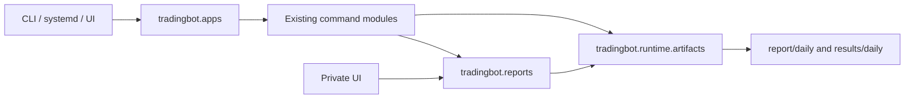

# Runtime Spine

The first refactor step introduces a small application package named
`tradingbot`. It gives shared runtime behavior a stable home while keeping the
existing commands intact.

## Goals

- Keep user-facing commands stable.
- Remove duplicated session and report artifact code.
- Give future refactors a package boundary that is easier to test than root scripts.
- Keep strategy logic out of generic runtime helpers.

## Current Shape



## Package Responsibilities

`tradingbot.runtime`

- Creates canonical daily numbered session folders.
- Writes JSON metadata safely.
- Appends CSV rows with stable headers.
- Loads live decision CSVs from nested daily sessions.
- Writes live session summaries.

`tradingbot.reports`

- Builds compact live daily, rolling, and full-history reports.
- Exports JSON/Markdown under `report/daily/YYYY-MM-DD/`.
- Serves both CLI reporting and private UI reporting.

`tradingbot.apps`

- Exposes lazy application entrypoints for live, backtest, train, UI, and live reports.
- Avoids importing the heavy trading stack until a command is actually run.

## Compatibility Commands

These commands remain supported:

```powershell
python backtest.py --pipeline rl_only --realism-profile live_like
python train.py --algo ALL
python run_live.py --exchange okx --mode testnet
python scripts/live_daily_report.py --date 2026-05-31 --export
python scripts/run_ui.py
```

## Next Refactor Candidates

- Move backtest orchestration from root `backtest.py` into `tradingbot.apps.backtest`.
- Move live orchestration from `scripts/run_live.py` into `tradingbot.apps.live`.
- Extract execution controls into a shared policy module used by both backtest and live.
- Move docs into the category folders after old links are replaced.

