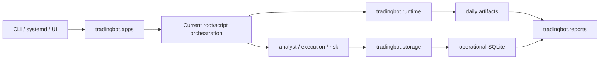

# Runtime Spine

The `tradingbot` package is the stable home for reusable application behavior.
Root files remain compatibility commands while orchestration moves inward.


```mermaid
flowchart LR
  operator["CLI / systemd / UI"] --> apps["tradingbot.apps"]
  apps --> orchestration["Current root/script orchestration"]
  orchestration --> domain["analyst / execution / risk"]
  domain --> storage["tradingbot.storage"]
  orchestration --> runtime["tradingbot.runtime"]
  runtime --> artifacts["daily artifacts"]
  storage --> sqlite["operational SQLite"]
  artifacts --> reports["tradingbot.reports"]
  sqlite --> reports
```

## Stable Interfaces

- `tradingbot.apps`: lazy command entrypoints.
- `tradingbot.runtime.artifacts`: numbered sessions and portable artifact writing.
- `tradingbot.storage`: database lifecycle and domain stores.
- `tradingbot.reports`: report payloads shared by CLI and UI.

## Compatibility Commands

```powershell
python train.py --algo ALL
python backtest.py --pipeline rl_only --realism-profile live_like
python run_live.py --exchange okx --mode testnet --dry-run
python scripts/live_daily_report.py --last-hours 24
python scripts/run_ui.py
```

## Refactor Direction

Keep compatibility commands stable. When shared logic appears in more than one
entrypoint, move the complete behavior behind a `tradingbot` interface and test
that interface. Do not create pass-through modules that merely rename existing
functions.
