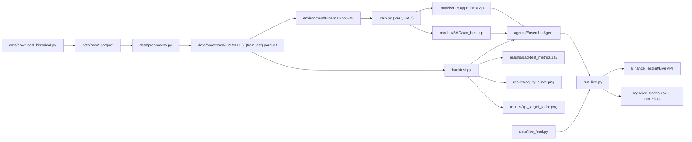
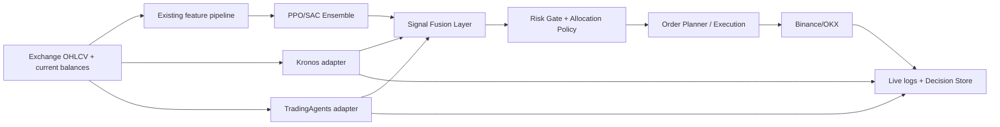

# BTC-ETH Trading: Comprehensive Documentation, Current Results, and Integration Plan

Last updated: 2026-05-22

## 1. Scope and Objective

This document provides:

1. A repository-grounded technical overview of the current BTC/ETH trading system.
2. A status report of the latest available backtest/live artifacts.
3. A concrete integration plan for:
   - Kronos (`shiyu-coder/Kronos`)
   - Multi-agent trading (`TauricResearch/TradingAgents`)

This is based on code and artifacts currently present in this workspace at:

- `K:\BTC-ETH Trading`

---

## 2. Project Snapshot

- Core objective: RL-based BTC/ETH spot portfolio management with cash allocation (USDT).
- Current production models: `PPO` and `SAC` ensemble.
- Data regime: multi-timeframe training features (1h, 4h, 1d) with train/test split:
  - Train: `2020-01-01` to `2023-12-31`
  - Test: `2024-01-01` to `2026-03-01` (effective last row: `2026-02-28 23:00:00+00:00`)
- Latest backtest artifact timestamp: `2026-03-31 02:24` (local file timestamp).
- Workspace note: this folder is not currently initialized as a Git repository (`.git` missing).

---

## 3. Repository Structure and Responsibilities

| Path | Role |
|---|---|
| `data/` | Historical download, preprocessing, live feed feature construction |
| `environment/trading_env.py` | Gymnasium trading environment, reward/cost logic, step dynamics |
| `agents/` | Ensemble inference and optional research components (VAE, logic sketch) |
| `metrics/performance.py` | KPI computation and chart generation |
| `train.py` | Root training entrypoint (PPO/SAC) |
| `backtest.py` | Root backtesting entrypoint and report writer |
| `run_live.py` | Root Binance live/testnet execution loop |
| `scripts/train.py` | Alternate training entrypoint (adds VAE training option) |
| `scripts/run_live.py` | Alternate live runner using CCXT + multi-exchange mode |
| `results/` | Backtest metrics and generated plots |
| `logs/` | Live run logs, monitor logs, TensorBoard events |
| `models/` | Trained checkpoints (`ppo_best.zip`, `sac_best.zip`, etc.) |

Important operational note:

- Root and `scripts/` entrypoints diverge in behavior and are not identical. This should be standardized before major extensions.

---

## 4. Current System Architecture

---

## 5. Data and Feature Contracts

## 5.1 Raw Data Inventory

Raw files exist for both `BTCUSDT` and `ETHUSDT` at:

- `1h`: 53,993 rows
- `4h`: 13,505 rows
- `1d`: 2,251 rows
- additional files present: `15m`, `30m`, `5m` (not part of current `MTF_TIMEFRAMES` training contract)

## 5.2 Processed Dataset Shape

Per symbol (`BTCUSDT`, `ETHUSDT`):

- `train`: 30,244 rows, 45 columns
  - Start: `2020-07-19 01:00:00+00:00`
  - End: `2023-12-31 23:00:00+00:00`
- `test`: 18,960 rows, 45 columns
  - Start: `2024-01-01 00:00:00+00:00`
  - End: `2026-02-28 23:00:00+00:00`

Observation contract in environment:

- Features exclude `log_return*` and `raw_*` columns from neural-network input.
- Observation size = `LOOKBACK_WINDOW * n_features * n_assets + (n_assets + 1)`.
- Action vector length = 2 (`BTC`, `ETH` logits), mapped to 3 weights (`BTC`, `ETH`, `USDT`).

---

## 6. Environment, Agent, and Execution Logic

## 6.1 Environment Highlights

Implemented in `environment/trading_env.py`:

- Spot-only weight allocation with implicit cash.
- Transaction costs include fee + slippage, with dust-trade suppression using `MIN_ORDER_USDT`.
- Rebalance deadband via `REBALANCE_THRESHOLD`.
- Dynamic ATR-based trailing-stop override.
- Reward includes profit, drawdown penalty, turnover penalty, opportunity-cost penalty.
- Additional `step_weights(...)` path supports direct weight execution (used by backtesting to avoid softmax round-trip distortions).

## 6.2 Ensemble Logic

Implemented in `agents/ensemble_agent.py`:

- Supported methods:
  - `mean`
  - `voting`
  - `weighted`
  - `dynamic_weighted`
  - `imca`
- Base models currently loaded from `models/PPO` and `models/SAC`.

## 6.3 Live Execution Paths

- Root `run_live.py`: Binance connector path.
- `scripts/run_live.py`: CCXT broker abstraction for Binance/OKX.

Both compute target weights from model output, compare with balances, and submit market rebalance orders above minimum notional.

---

## 7. Current Results (From Stored Artifacts)

Status date of artifact set: `2026-03-31` (file timestamps in `results/`).

## 7.1 Backtest Metrics (`results/backtest_metrics.csv`)

| Metric | Value |
|---|---:|
| total_return_pct | 50.8435 |
| annualised_return_pct | 21.0558 |
| win_rate_pct | 47.1974 |
| profit_factor | 1.0249 |
| expectancy_pct | 0.0031 |
| avg_win_loss_ratio | 1.1466 |
| max_drawdown_pct | -49.5522 |
| sharpe_ratio | 0.4734 |
| sortino_ratio | 0.6370 |
| calmar_ratio | 0.4249 |
| recovery_factor | 1.0261 |
| ulcer_index | 17.5622 |
| avg_drawdown_duration_steps | 111.7006 |
| time_in_market_pct | 47.1974 |
| total_trades_count | 14011 |

## 7.2 Episode-Level Context (`results/backtest_episode.parquet`)

- Steps: 18,930
- Start timestamp: `2024-01-02 06:00:00+00:00`
- End timestamp: `2026-02-28 23:00:00+00:00`
- Start NAV: `~9,981.55`
- End NAV: `~15,084.35`
- Peak NAV: `~27,634.37` at `2025-08-24 19:00:00+00:00`
- Lowest NAV: `~9,490.49` at `2024-01-23 20:00:00+00:00`
- Mean allocation:
  - BTC: `0.2361`
  - ETH: `0.3615`
  - Cash: `0.4024`

Interpretation:

- Return is positive in aggregate but risk-adjusted performance is weak.
- Drawdown profile is severe (`~ -49.55%`) and dominates risk concerns.
- Trade count and churn are very high for hourly cadence.

## 7.3 Live/Testnet Log Signals

Observed from `logs/run_testnet.log` and `logs/live_trades.csv`:

- Multiple successful testnet order fills are recorded.
- Intermittent API timestamp errors appear:
  - Binance `-1021`: request timestamp outside `recvWindow`.
- Intermittent balance errors appear:
  - Binance `-2010`: insufficient balance.
- PnL logging inconsistency exists in root live runner:
  - In testnet mode, cycle-1 baseline is hardcoded to `10000.0` instead of current NAV, causing inflated session PnL percentages when starting with larger balances.

## 7.4 Reproducibility Note at Audit Time

At audit time, direct rerun of `python backtest.py --method mean` failed in this local runtime due to missing dependency:

- `ModuleNotFoundError: No module named 'loguru'`

So this report uses repository artifacts as the current validated output.

---

## 8. Key Risks and Technical Debt Before Major Integration

1. Entrypoint drift:
   - Root scripts and `scripts/` variants diverge (training/live behavior differences).
2. Live/training feature mismatch risk:
   - Training uses multi-timeframe merged features; root live feed path currently builds only latest single-timeframe features then pads/truncates observation vectors.
3. Portfolio-state mismatch risk in live inference:
   - Live observation appends static placeholder portfolio weights instead of real current weights from account state.
4. Dependency drift:
   - Runtime environment may not satisfy `requirements.txt` (demonstrated by missing `loguru`).
5. Monitoring and auditability:
   - No single canonical runbook for "which runner is authoritative."

---

## 9. Integration Plan: Kronos + Multi-Agent Trading

Assumption used in this plan:

- Kronos = `https://github.com/shiyu-coder/Kronos`
- Multi-agent component = `https://github.com/TauricResearch/TradingAgents`

If you intended different repositories, keep the architecture below and swap adapters.

## 9.1 External Component Capabilities (Repository-Evidenced)

Kronos highlights:

- Foundation model for financial candlesticks (K-lines), with open-source `mini/small/base` models.
- `KronosPredictor` takes OHLC (required), optional volume/amount, timestamps, and returns forecast DataFrame.
- Supports batched prediction (`predict_batch`), useful for multi-symbol inference.

TradingAgents highlights:

- LangGraph-based multi-agent decision engine with analyst/researcher/trader/risk roles.
- Python integration path via `TradingAgentsGraph(...).propagate(...)`.
- Built-in decision memory and optional checkpoint resume.
- Supports many LLM providers and optional Alpha Vantage key.

## 9.2 Target Integration Architecture

## 9.3 Phased Delivery Plan

### Phase 0: Baseline Hardening (required first)

Deliverables:

- Choose one canonical runtime path:
  - either root entrypoints
  - or `scripts/` entrypoints
- Lock dependencies with reproducible environment setup.
- Add a "smoke run" command set:
  - preprocess
  - train (short horizon)
  - backtest
  - dry-run live cycle

Exit criteria:

- One-command reproducible backtest run on a clean machine.

### Phase 1: Kronos Adapter

Implement:

- `adapters/kronos_adapter.py`
- Input contract from current candles:
  - DataFrame columns: `open, high, low, close` (+ optional `volume`)
  - aligned timestamps
- Output contract:
  - forecast horizon returns and confidence summary
  - e.g., `kronos_ret_1h`, `kronos_ret_4h`, `kronos_conf`

Integration points:

- Add Kronos signals to:
  - environment observations for retraining path, or
  - post-model fusion layer for inference-only path

Recommended first step:

- Start with inference-only fusion (no retraining) to de-risk interface.

### Phase 2: TradingAgents Adapter

Implement:

- `adapters/tradingagents_adapter.py`
- Wrapper around `TradingAgentsGraph`:
  - ticker mapping (`BTCUSDT`/`ETHUSDT` -> supported symbol format)
  - date handling
  - timeout and retry policy
- Normalize output decision into numeric biases:
  - `bullish/bearish/neutral` -> signed score
  - optional confidence score

Persistence:

- Keep TradingAgents decision log path configurable for audit trail.

### Phase 3: Signal Fusion and Policy Layer

Implement:

- `agents/meta_fusion_agent.py` (new)
- Inputs:
  - PPO/SAC allocation proposal
  - Kronos forecast signal
  - TradingAgents directional/risk bias
- Output:
  - constrained target allocation

Suggested fusion rule (initial):

1. Use RL ensemble as base allocation.
2. Apply Kronos short-horizon tilt (small bounded adjustment).
3. Apply TradingAgents risk governor (position cap/cash floor during high-risk narrative).
4. Enforce global risk constraints:
   - max per-asset weight
   - max turnover
   - min cash floor under uncertainty

### Phase 4: Evaluation Matrix

Backtest ablations:

1. RL only (current baseline)
2. RL + Kronos
3. RL + TradingAgents
4. RL + Kronos + TradingAgents

Compare on:

- return, Sharpe, Sortino, max drawdown, Calmar
- turnover and trade count
- regime-specific performance (trend vs high-volatility periods)

### Phase 5: Controlled Live Rollout

1. Dry-run execution only (no order submission)
2. Testnet with hard notional caps
3. Gradual increase with kill-switches and drift alerts

Operational gates:

- stop if live slippage/turnover exceeds threshold
- stop if decision services unavailable or stale

---

## 10. Recommended File-Level Additions for Integration

Suggested new modules:

- `adapters/kronos_adapter.py`
- `adapters/tradingagents_adapter.py`
- `agents/meta_fusion_agent.py`
- `risk/risk_constraints.py`
- `tests/test_kronos_adapter.py`
- `tests/test_tradingagents_adapter.py`
- `tests/test_meta_fusion_agent.py`

Suggested config extensions (`config.py`):

- `ENABLE_KRONOS`
- `ENABLE_TRADINGAGENTS`
- `KRONOS_MODEL_ID`
- `TRADINGAGENTS_PROVIDER`
- `MAX_TILT_PER_SIGNAL`
- `MAX_PORTFOLIO_TURNOVER`
- `FALLBACK_MODE` (RL-only fail-safe)

---

## 11. External References Used for This Plan

- Kronos repository:
  - https://github.com/shiyu-coder/Kronos
- TradingAgents repository:
  - https://github.com/TauricResearch/TradingAgents

These sources were used to derive integration assumptions (APIs, runtime requirements, and supported usage patterns).

