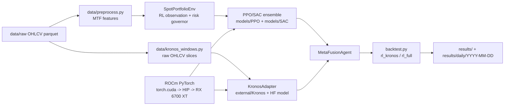

# ROCm Runtime Architecture And Usage

Last updated: 2026-05-24

This document explains how this repository uses the local AMD ROCm stack for
PPO/SAC inference/training and Kronos GPU forecasting. It is a repo-specific
runtime guide, not a generic ROCm installation guide. For installation notes,
see `docs/rx6700xt_rocm_training.md`.

## Current Verified Runtime

The current local environment reports:

```text
Python: 3.12.10
PyTorch: 2.9.1+rocmsdk20251207
HIP: 7.2.53150-dc1f946c0b
GPU available through torch.cuda: True
GPU device: AMD Radeon RX 6700 XT
rocminfo on PATH: False
hipcc on PATH: True
```

Important naming detail: PyTorch exposes ROCm devices through the CUDA-style
API (`torch.cuda`). In this repo, `device="cuda"` or `device="cuda:0"` means
"use the ROCm-backed AMD GPU" when `torch.version.hip` is populated.

## Runtime Flow



## Components

| Component | File or path | ROCm role |
|---|---|---|
| GPU verifier | `scripts/verify_gpu_training_stack.py` | Confirms ROCm PyTorch is usable from this venv. |
| RL training | `train.py` | Resolves `--device auto` to `cuda` when ROCm PyTorch sees the GPU. |
| RL inference | `agents/ensemble_agent.py` through SB3 models | Loads PPO/SAC; PyTorch may use ROCm for model inference. |
| Trading env | `environment/trading_env.py` | CPU-side portfolio simulation, reward, risk governor, transaction-cost accounting. |
| Kronos windows | `data/kronos_windows.py` | Supplies raw OHLCV windows because Kronos needs price bars, not engineered features. |
| Kronos adapter | `adapters/kronos_adapter.py` | Loads external Kronos code and initializes `KronosPredictor` on `cuda:0` when available. |
| Fusion | `agents/meta_fusion_agent.py` | Applies bounded Kronos tilts to RL weights. |
| Backtest | `backtest.py` | Orchestrates RL-only, RL+Kronos, TradingAgents, and full-fusion pipelines. |

## Environment Requirements

Use the repo-local venv:

```powershell
.\.venv\Scripts\Activate.ps1
```

Kronos is source-based and must be available locally:

```powershell
git clone https://github.com/shiyu-coder/Kronos.git external/Kronos
$env:KRONOS_REPO_PATH = (Resolve-Path .\external\Kronos).Path
```

If you open a new PowerShell session, set `KRONOS_REPO_PATH` again before a
Kronos run. Without it, `KronosAdapter` cannot import `model.Kronos`,
`KronosPredictor`, and `KronosTokenizer`.

## Verify ROCm

Run:

```powershell
.\.venv\Scripts\python.exe scripts\verify_gpu_training_stack.py
```

Expected success shape:

```text
torch installed: True
torch GPU available: True
torch HIP version: <non-empty>
GPU name: AMD Radeon RX 6700 XT
ready for ROCm training: True
```

Direct PyTorch check:

```powershell
@'
import torch
print(torch.__version__)
print(torch.version.hip)
print(torch.cuda.is_available())
print(torch.cuda.get_device_name(0) if torch.cuda.is_available() else None)
'@ | .\.venv\Scripts\python.exe -
```

## Run PPO/SAC With ROCm

Training uses `--device auto` by default from config, but explicit is clearer:

```powershell
.\.venv\Scripts\python.exe train.py --algo ALL --device auto --seed 42 --validation-fraction 0.2
```

Use `--require-gpu` if the run must fail instead of silently falling back to CPU:

```powershell
.\.venv\Scripts\python.exe train.py --algo ALL --device auto --require-gpu
```

Note: Stable-Baselines3 warns that PPO MLP policies may be slower on GPU. This
is expected. SAC generally has more GPU-friendly update work. The warning is not
an error if `torch.version.hip` is set and the verifier passes.

## Run Kronos On GPU

Set the Kronos source path for the current shell:

```powershell
$env:KRONOS_REPO_PATH = (Resolve-Path .\external\Kronos).Path
```

Run RL + Kronos only:

```powershell
.\.venv\Scripts\python.exe backtest.py --pipeline rl_kronos --realism-profile live_like --method dynamic_weighted
```

Run full fusion, including TradingAgents if enabled:

```powershell
.\.venv\Scripts\python.exe backtest.py --pipeline rl_full --realism-profile live_like --method dynamic_weighted
```

For a successful native Kronos GPU run, logs should contain a line like:

```text
Kronos backend initialized (NeoQuasar/Kronos-mini) on cuda:0.
```

Episode diagnostics should show:

```text
kronos_available: True
kronos_signal_count: 2
kronos_sources: kronos
fusion_has_kronos: True
```

## 2026-05-24 Kronos GPU Smoke Backtest

Command used:

```powershell
$env:KRONOS_REPO_PATH = (Resolve-Path .\external\Kronos).Path
.\.venv\Scripts\python.exe backtest.py --pipeline rl_kronos --realism-profile live_like --method dynamic_weighted
```

Observed runtime behavior:

| Check | Result |
|---|---:|
| Kronos backend | `NeoQuasar/Kronos-mini` on `cuda:0` |
| Episode rows | 20,934 |
| Kronos available rate | 100.00% |
| Kronos signal count | 2 symbols on every row |
| TradingAgents available | False, by design for `rl_kronos` |

Backtest metrics from this run:

| Metric | Value |
|---|---:|
| Total return | -7.82% |
| Sharpe | -0.1053 |
| Max drawdown | -43.14% |
| Trades | 16,654 |
| Mean BTC weight | 31.02% |
| Mean ETH weight | 30.38% |
| Mean cash weight | 38.60% |
| Risk governor active rate | 91.55% |

Artifacts were preserved under:

- `results/daily/2026-05-24/kronos_gpu_full_backtest/`
- `report/daily/2026-05-24/kronos_gpu_full_backtest/`

Interpretation: GPU/Kronos integration is operational, but the current Kronos
fusion signal is not yet performance-positive. Treat this as an integration
success and a strategy-quality failure until the tilt calibration is improved.

## Troubleshooting

| Symptom | Likely cause | Fix |
|---|---|---|
| `torch.cuda.is_available()` is `False` | CPU PyTorch replaced ROCm PyTorch | Reinstall ROCm PyTorch wheel set, then rerun verifier. |
| `torch.version.hip` is `None` | Not a ROCm build | Reinstall ROCm PyTorch; do not rely on package name alone. |
| `Kronos module not importable` | `KRONOS_REPO_PATH` missing or wrong | Set `$env:KRONOS_REPO_PATH = (Resolve-Path .\external\Kronos).Path`. |
| Kronos initializes on CPU | PyTorch cannot see ROCm GPU | Run verifier; check ROCm wheel and HIP runtime. |
| `rocminfo on PATH: False` but verifier ready | Windows community stack exposes torch/hip without `rocminfo` | Accept for this venv if `torch.cuda.is_available()` and `torch.version.hip` are good. |
| Memory-efficient attention warning | Current PyTorch/ROCm build limitation | Usually safe; monitor runtime and memory, but not a hard failure. |
| Kronos backtest is slow | Native Kronos inference runs per timestamp and symbol | Use `rl_kronos` for focused tests; add caching/cadence before large matrices. |

## Operational Rules

- Preserve generated run outputs under `results/daily/YYYY-MM-DD/` before
  reporting completion.
- Preserve long logs under `report/daily/YYYY-MM-DD/<run-name>/`.
- Do not commit `.env`, raw data, models, logs, venvs, external Kronos clones,
  or archive snapshots.
- When reporting GPU runs, include both integration status and performance
  metrics. A native Kronos signal can still be a bad trading signal.
