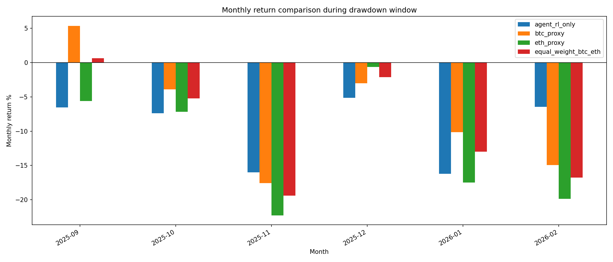
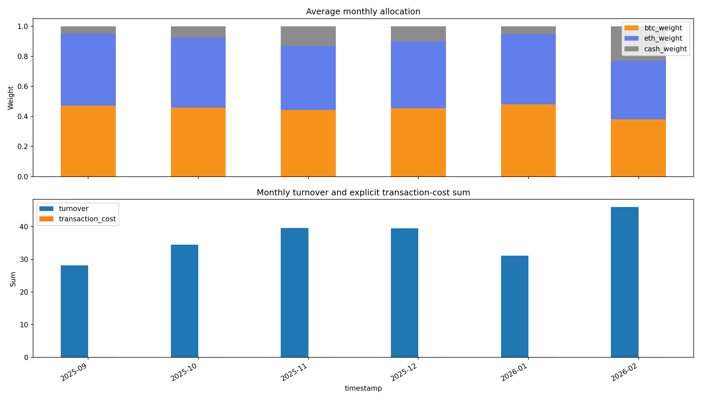
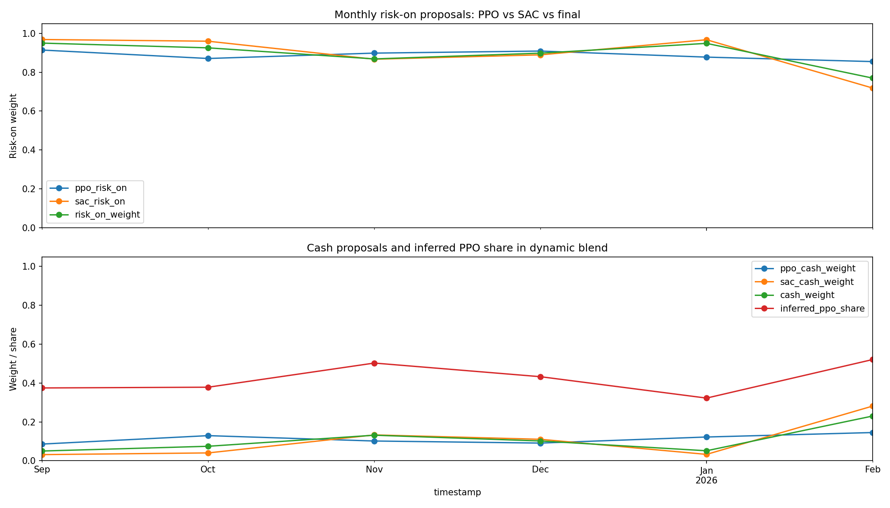
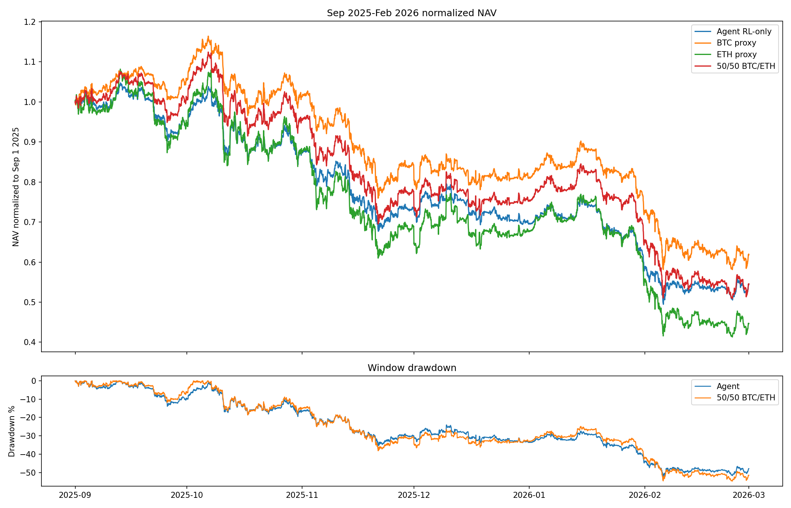

# Late-2025 / Early-2026 RL Drawdown Diagnosis

Date: 2026-05-23

## Executive Conclusion

The agent did not fail because Kronos or TradingAgents injected bad trades. The latest `rl_only` and `rl_full` backtests are effectively identical, so the external overlays were no-op during this period.

The drawdown was caused by the base RL policy staying structurally risk-on through a BTC/ETH stress regime. From September 2025 through January 2026, the portfolio kept roughly 87-95% exposure to BTC/ETH and only rotated meaningfully toward cash in February 2026, after the deepest drawdown had already occurred. The reward/config stack also does not directly penalize turnover (`turnover = 0.0`) and only enforces a 5% cash floor, so the agent has weak incentives to preserve capital in tail regimes.

Root causes, ranked:

1. Persistent BTC/ETH exposure through a market-wide crypto drawdown.
2. Insufficient tail-risk / regime-shift defense; cash rotation came late.
3. Severe churn and transaction-cost drag.
4. Dynamic ensemble adaptation was too slow or too weak to override both PPO/SAC staying risk-on.
5. External overlays were unavailable/no-op, so they did not help, but they also did not cause the loss.

## Local Forensics

Artifacts used:

- `results/backtest_episode_rl_only_live_like.parquet`
- `results/backtest_episode_rl_full_live_like.parquet`
- `results/backtest_matrix_metrics.csv`
- `results/backtest_ensemble_method_comparison.csv`
- `data/processed/BTCUSDT_test.parquet`
- `data/processed/ETHUSDT_test.parquet`

Generated diagnostic artifacts:

- `report/2026-05-23_session/drawdown_diagnosis/monthly_return_comparison.csv`
- `report/2026-05-23_session/drawdown_diagnosis/monthly_agent_exposure_cost_policy.csv`
- `report/2026-05-23_session/drawdown_diagnosis/period_return_summary.csv`
- `report/2026-05-23_session/drawdown_diagnosis/overlay_noop_check.csv`
- `report/2026-05-23_session/drawdown_diagnosis/trough_snapshot.csv`
- `report/2026-05-23_session/drawdown_diagnosis/worst_hours_sep2025_feb2026.csv`

### Headline Metrics

| Item | Value |
| --- | ---: |
| Latest live-like dynamic-weighted return | `13.05%` |
| Latest live-like dynamic-weighted Sharpe | `0.1153` |
| Max drawdown | `-55.72%` |
| Drawdown trough | `2026-02-06 00:00 UTC` |
| Sep 2025-Feb 2026 agent return | `-44.47%` |
| Sep 2025-Feb 2026 BTC proxy return | `-38.12%` |
| Sep 2025-Feb 2026 ETH proxy return | `-55.32%` |
| Sep 2025-Feb 2026 equal-weight BTC/ETH proxy return | `-45.50%` |
| Dynamic-weighted cost drag, full live-like backtest | `-93.42%` |

The agent behaved close to a high-beta BTC/ETH allocator during the drawdown window. It did not materially outperform the equal-weight benchmark through the stress regime, despite active management and significant turnover.

## Monthly Return Comparison

| Month | Agent | BTC proxy | ETH proxy | 50/50 BTC/ETH |
| --- | ---: | ---: | ---: | ---: |
| 2025-09 | `-6.52%` | `5.36%` | `-5.62%` | `0.65%` |
| 2025-10 | `-7.38%` | `-3.89%` | `-7.17%` | `-5.21%` |
| 2025-11 | `-16.00%` | `-17.56%` | `-22.26%` | `-19.41%` |
| 2025-12 | `-5.15%` | `-3.00%` | `-0.66%` | `-2.11%` |
| 2026-01 | `-16.21%` | `-10.16%` | `-17.49%` | `-12.99%` |
| 2026-02 | `-6.45%` | `-14.94%` | `-19.88%` | `-16.75%` |

Interpretation:

- September is especially revealing: BTC was positive and ETH was negative, but the agent still lost `-6.52%`, which points to ETH exposure, churn, and timing/friction rather than pure market beta.
- November and January were the largest loss months and align with broad market stress in BTC/ETH proxies.
- February shows some de-risking benefit versus benchmark, but it happened after the cumulative drawdown was already severe.

## Exposure, Cost, And Policy Behavior

| Month | Agent return | BTC wt | ETH wt | Cash wt | Turnover sum | Cost sum | Cost drag | PPO risk-on | SAC risk-on | Inferred PPO share |
| --- | ---: | ---: | ---: | ---: | ---: | ---: | ---: | ---: | ---: | ---: |
| 2025-09 | `-5.69%` | `47.18%` | `47.83%` | `4.99%` | `28.15` | `0.0844` | `-8.10%` | `91.44%` | `96.86%` | `37.46%` |
| 2025-10 | `-7.38%` | `45.83%` | `46.74%` | `7.43%` | `34.47` | `0.1034` | `-9.83%` | `87.09%` | `95.99%` | `37.84%` |
| 2025-11 | `-16.00%` | `44.34%` | `42.54%` | `13.13%` | `39.60` | `0.1188` | `-11.21%` | `89.86%` | `86.72%` | `50.28%` |
| 2025-12 | `-5.15%` | `45.39%` | `44.44%` | `10.17%` | `39.51` | `0.1185` | `-11.18%` | `90.92%` | `88.97%` | `43.25%` |
| 2026-01 | `-16.21%` | `48.03%` | `46.85%` | `5.12%` | `31.17` | `0.0935` | `-8.93%` | `87.80%` | `96.75%` | `32.24%` |
| 2026-02 | `-6.45%` | `38.08%` | `38.91%` | `23.00%` | `46.01` | `0.1380` | `-12.90%` | `85.50%` | `71.88%` | `52.08%` |

Interpretation:

- The policy stayed near fully invested until February. Cash averaged only `4.99%` in September and `5.12%` in January.
- SAC stayed more risk-on than PPO in September, October, and January. Dynamic weighting leaned toward SAC in those periods, which likely worsened exposure during the stress transition.
- Cost drag was meaningful every month. Even though explicit per-step fees look small, repeated turnover compounded into large drag.
- February de-risking was late and expensive: cash rose to `23.00%`, but turnover and cost drag were the highest in the window.

## NAV And Drawdown Shape

The agent's drawdown path resembles the equal-weight BTC/ETH drawdown rather than a defensive strategy. That means the agent's active policy did not discover a robust stress-regime escape rule.

## Overlay No-Op Check

`rl_only` and `rl_full` are practically identical:

| Metric | Value |
| --- | ---: |
| Max absolute NAV difference | `0.014163` |
| Final NAV difference | `0.000373` |
| RL-only final return | `13.053090%` |
| RL-full final return | `13.053086%` |

Conclusion: Kronos and TradingAgents did not cause the drawdown. They were unavailable/no-op, so the portfolio was effectively RL-only.

## Method Comparison

Latest method comparison from `results/backtest_ensemble_method_comparison.csv`:

| Method | Return | Sharpe | Max DD | Trades | Cost drag |
| --- | ---: | ---: | ---: | ---: | ---: |
| `mean` | `-4.24%` | `-0.0412` | `-57.94%` | `8,625` | `-94.04%` |
| `voting` | `-99.84%` | `-5.5967` | `-99.86%` | `2,980` | `-99.98%` |
| `weighted` | `-4.24%` | `-0.0412` | `-57.94%` | `8,625` | `-94.04%` |
| `dynamic_weighted` | `13.05%` | `0.1153` | `-55.72%` | `8,031` | `-93.42%` |
| `imca` | `-50.89%` | `-0.6884` | `-69.07%` | `10,063` | `-96.83%` |

Dynamic-weighted is still the least bad current method, but it is not genuinely risk-robust. It improves return relative to mean/weighted, but drawdown remains almost as bad.

## Literature Mapping

The local failure pattern matches several known findings in RL portfolio research:

- Jiang, Xu, and Liang's crypto portfolio RL framework shows why the architecture can work in principle, but its success depends heavily on explicit reward/execution design, portfolio memory, and adapting to cryptocurrency-specific dynamics. Their setup also assumes the learned policy can exploit market structure despite high commission. Source: [arXiv:1706.10059](https://arxiv.org/abs/1706.10059).
- Zhang et al. identify two core difficulties that match this project's failure: non-stationary prices and the need to control both transaction and risk costs. The current agent has `turnover = 0.0` in reward config and very high realized cost drag, so it is under-incentivized to avoid churn. Source: [arXiv:2003.03051](https://arxiv.org/abs/2003.03051).
- Wang and Klabjan emphasize multiple validation periods, granular out-of-sample evaluation, and periodic retraining for crypto DRL because financial data is non-stationary. The current dynamic ensemble uses recent performance adaptation, but it did not detect the 2025-2026 stress transition fast enough. Source: [arXiv:2309.00626](https://arxiv.org/abs/2309.00626).
- Regime/tail-dependent crypto CVaR research reports that no strategy dominates across regimes, and learning-based strategies can preserve return potential while suffering worse stress-regime drawdowns. This directly fits the agent's high risk-on behavior and weak stress defense. Source: [IJFS 14(3):53](https://www.mdpi.com/2227-7072/14/3/53).
- FinRL's design notes highlight transaction cost, market liquidity, and investor risk aversion as important trading constraints. The current system has live-like fees/slippage, but the learned reward still does not strongly optimize for cost and drawdown robustness. Source: [arXiv:2011.09607](https://arxiv.org/abs/2011.09607).

## Evidence-Backed Root Causes

### 1. Persistent Risk-On Exposure During Stress

Evidence:

- Sep-Jan average cash was mostly `5-13%`.
- January, a major loss month, had only `5.12%` average cash.
- The equal-weight benchmark lost `-45.50%` Sep-Feb, and the agent lost `-44.47%` over the same window.

Conclusion: the agent was still behaving like a high-beta BTC/ETH allocator, not a defensive regime-aware policy.

### 2. Late De-Risking

Evidence:

- February cash rose to `23.00%`, but the full drawdown trough had already arrived on `2026-02-06`.
- February still lost `-6.45%`, but benchmark losses were much worse, implying the de-risking helped only after cumulative losses were already severe.

Conclusion: the policy has some capacity to reduce exposure, but it responds too late for abrupt regime changes.

### 3. Transaction Cost / Turnover Drag

Evidence:

- Dynamic-weighted full-run cost drag is `-93.42%`.
- Monthly Sep-Feb cost drag ranged from `-8.10%` to `-12.90%`.
- Reward config has `turnover = 0.0`, so the agent is not directly punished for rebalancing churn beyond environment-level cost effects.

Conclusion: the strategy pays a large compounding cost tax. This is not merely a broker-fee issue; it is a policy objective issue.

### 4. Dynamic Ensemble Adapted In The Wrong Direction During Some Stress Months

Evidence:

- SAC risk-on averaged `96.86%` in September, `95.99%` in October, and `96.75%` in January.
- Inferred PPO share was low in September/October/January (`~32-38%`), so dynamic weighting leaned more toward the more risk-on SAC proposal.

Conclusion: dynamic weighting helped overall versus mean/weighted, but it is not regime-aware enough. It can reinforce the wrong policy when recent reward signals do not yet reflect a regime break.

## Hypotheses To Validate Next

These are likely but need controlled ablations before treating them as proven:

1. Increasing the reward turnover penalty will improve Sharpe more than it hurts return.
2. A volatility/CVaR regime gate that increases cash floor during stress will reduce the 2026 drawdown materially.
3. Validation on multiple rolling windows will prevent the dynamic ensemble from over-trusting a model that works in calm/uptrend regimes but fails in stress.
4. Adding explicit benchmark-relative reward or downside-risk objective will reduce ETH/BTC beta during market-wide selloffs.

## Recommended Improvement Passes

1. Add regime-aware risk governor before retraining:
   - Increase cash floor when rolling volatility or drawdown regime exceeds threshold.
   - Cap risk-on exposure during stress regimes.
   - Evaluate as a backtest-only risk wrapper first.

2. Make the reward cost-sensitive:
   - Set nonzero turnover penalty.
   - Add cost-drag and realized drawdown diagnostics to EvalCallback selection.
   - Select checkpoints by validation Sharpe/drawdown/cost composite, not episode reward alone.

3. Replace simple dynamic weighting with regime-conditioned model selection:
   - Track PPO/SAC validation performance by volatility/drawdown regime.
   - Use multiple validation windows as in crypto DRL ensemble literature.
   - Add a hard rule that recent drawdown acceleration reduces risk-on allocation even if model Sharpe is stale.

4. Add CVaR/tail-risk training objective or constraint:
   - Penalize lower-tail returns, not only average log return.
   - Evaluate CVaR(95/99), max drawdown, and ulcer index as primary metrics.

5. Run ablations before retraining big:
   - `dynamic_weighted + stress cash gate`
   - `dynamic_weighted + turnover penalty`
   - `dynamic_weighted + CVaR penalty`
   - `dynamic_weighted + rolling multi-window validation`

## Final Answer

The agent lost so much in late 2025 to early 2026 because it stayed invested in BTC/ETH through a broad crypto stress regime, with too little cash and too much churn. Its active RL policy did not function as a stress-regime detector; it behaved close to a high-beta equal-weight crypto allocator until February 2026. Dynamic weighting improved total return relative to other ensemble methods, but it did not solve tail-risk exposure. The next serious improvement should be a regime-aware risk governor plus cost-sensitive / CVaR-aware training hygiene, not another blind retrain.

