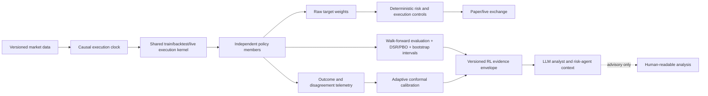

# RL Reliability Research and LLM Evidence Plan

**Date:** 2026-07-21

**Status:** Proposed

**Scope:** BTC/ETH/USDT RL training, evaluation, live inference, and the evidence supplied to LLM analyst/agent roles

## Executive decision

Do not optimize or promote another model against the current `107.06%` champion yet. The immediate priority is to repair the experiment clock and rebuild a trustworthy baseline.

The current environment gives a newly selected allocation the return of the last bar already visible in its observation. If the observation covers rows `[t-L, t)`, it includes the close at `t-1`; however, `_get_returns()` currently returns `log_return[t-1] = close[t-1] / close[t-2]`. The new action is therefore credited retroactively with a return that was known before the action existed. The next tradable close-to-close return is `log_return[t]`, subject to the chosen fill convention, latency, fees, and slippage. See [`environment/trading_env.py`](../../environment/trading_env.py) around `_get_obs()` and `_get_returns()`.

This flaw affects training and backtesting and invalidates the current checkpoints as reliable evidence. It is also consistent with the gap between the protected champion and later fresh challengers:

- The protected result reports `107.06%` return, `0.8492` Sharpe, `-36.78%` maximum drawdown, and `14,660` cost-bearing steps in [`backtest_metrics_rl_only_live_like_dynamic_weighted.csv`](../../results/important/model_backups/2026-05-24_107pct_baseline/backtest_metrics_rl_only_live_like_dynamic_weighted.csv).
- The latest quick fresh challengers reached only `0.04–0.12` Sharpe in [`experiment_metrics.csv`](../../results/daily/2026-06-05/kpi_improvement_experiment/2/experiment_metrics.csv). These are not controlled replications of the champion, but the size of the collapse reinforces that single-checkpoint performance is not stable evidence.

The target architecture is therefore:



Raw weights remain in the deterministic execution path. LLM agents receive a non-executable, time-bounded evidence summary with provenance, uncertainty, and an explicit `verified`, `caution`, or `abstain` state.

## Research questions

1. Which defects currently prevent the RL output from being credible out of sample?
2. Which peer-reviewed methods most directly improve statistical reliability, tail behavior, partial observability, and sample efficiency?
3. What contract lets LLM agents use RL as evidence without treating an uncalibrated action or self-reported confidence as fact?

“Recent” was interpreted as 2020–2026 for algorithmic work, while retaining older papers when they remain the strongest primary source for a required control such as backtest selection bias or ensemble uncertainty.

## Repository diagnosis

### P0: action/return timing is retroactive

Current sequence in [`environment/trading_env.py`](../../environment/trading_env.py):

1. `_get_obs()` returns features through row `t-1`.
2. The policy chooses a new allocation.
3. `_get_returns()` returns row `t-1`, the return from `close[t-2]` to `close[t-1]`.
4. The new allocation receives that already-realized return.

Required sequence:

1. Observe completed data through `t-1`.
2. Choose the allocation at the `t-1` decision boundary.
3. Apply an explicit fill rule.
4. Earn only returns after the fill: minimally `close[t] / close[t-1]`, or a more detailed next-open/intrabar model.

Add a tiny deterministic regression fixture in which the last observed bar rises and the next bar falls. A policy that buys after seeing the rise must receive the next loss, never the prior gain. Test timestamps, weights effective time, and PnL attribution together.

### P0: the validation episodes are duplicates, not replications

[`train.py`](../../train.py) uses `EvalCallback(..., n_eval_episodes=5, deterministic=True)`, but [`SpotPortfolioEnv.reset()`](../../environment/trading_env.py) always resets to the same first row and does not randomize the episode window. Those five evaluations replay the same market path with the same deterministic policy. PPO's parallel environments also share the same exogenous path; their seeds can change policy sampling but do not create independent market episodes.

Consequences:

- early stopping is based on one repeated path;
- the reported mean evaluation reward has no episode-level uncertainty;
- training repeatedly sees the same chronological trajectory;
- seed and checkpoint selection can overfit one path without detection.

### P0: the final test period has become development data

The 2024-01-01 through 2026-06-04 backtest period has been repeatedly used to compare methods, overlays, seeds, reward variants, and checkpoints. Regardless of whether model gradients saw it, selection decisions did. It must now be classified as research/development history, not a sealed final holdout.

No historical rewrite can recreate a pristine holdout. Use rolling-origin development folds for research and reserve data arriving after the new protocol is frozen for prospective paper/shadow validation.

### P1: train, backtest, and live semantics diverge

- Training feeds raw two-dimensional actions into `step()`, including action smoothing and environment controls.
- Backtesting converts policy actions to weights and calls `step_weights()`.
- Live execution implements another copy of execution controls in `LiveExecutionController`.
- Backtesting updates the `dynamic_weighted` PPO/SAC scores with `_update_adaptive_ensemble_weights()`. [`scripts/run_live.py`](../../scripts/run_live.py) never performs that update, so `dynamic_weighted` starts and remains an equal-weight blend in live operation.

Extract one versioned execution-state machine used by training, backtesting, and live/paper simulation. The policy may propose; one shared component determines effective weights, costs, latency, cooldowns, stops, and state transitions.

### P1: hidden execution state makes the policy's problem partially observable

The observation contains market windows and current weights, but action effects also depend on hidden state such as:

- portfolio high-water mark and rolling drawdown;
- asset trailing peaks;
- time since the last material trade and last trade direction;
- risk-governor, turnover-cap, re-entry-lock, and semi-auto state;
- recent-return history used by tail-risk reward terms.

The same visible observation and action can therefore produce different transitions. First expose the decision-relevant state explicitly. Then test a recurrent policy as a challenger if memory still adds value.

### P1: the reward mixes objectives and double-counts some costs

`net_return` already includes transaction cost before the log-return reward is calculated, after which `transaction_cost` is subtracted again as a separate reward term. That may be intentional turnover shaping, but it is currently indistinguishable from accidental double charging. Drawdown, asymmetric negative returns, rolling tail loss, missed opportunity, action delta, hard stops, and the risk governor also interact.

Establish a plain economic reward baseline—net log return after modeled costs—then add one risk term at a time. Report both economic outcomes and reward components so a higher training reward cannot hide worse net performance.

### P1: RL output has no calibrated reliability contract

Live logs include weights and operational diagnostics, but not an outcome interval, coverage statistic, out-of-distribution score, member disagreement, experiment provenance, or an abstention decision. Meanwhile, LLM `confidence` is accepted as a number without empirical calibration.

The LLM-facing source must state what is known, how recently it was measured, and why the source is or is not currently reliable. LLM self-confidence must never substitute for RL evidence quality.

## Paper selection standard

The core set favors peer-reviewed top ML venues or established quantitative-finance journals, primary paper pages, clear methods, and lessons that map to this repository. A novel architecture with weak transfer fit ranks below an older control that can invalidate a false trading result.

| Paper | Trust basis | Novelty | Repository fit | Decision |
|---|---|---:|---:|---|
| Agarwal et al., 2021, *Deep RL at the Edge of the Statistical Precipice* | NeurIPS Outstanding Paper; open evaluation library | High | Very high | Implement first |
| Bailey et al., 2017, *The Probability of Backtest Overfitting* | Journal of Computational Finance | High | Very high | Implement first |
| Bailey & López de Prado, 2014, *The Deflated Sharpe Ratio* | Journal of Portfolio Management | High | Very high | Implement first |
| Lakshminarayanan et al., 2017, *Deep Ensembles* | NeurIPS; broad empirical validation | Foundational | High | Implement for uncertainty |
| Gibbs & Candès, 2021, *Adaptive Conformal Inference Under Distribution Shift* | NeurIPS; online coverage result | Very high | Very high | Implement for agent evidence |
| Kuznetsov et al., 2020, *Truncated Quantile Critics* | ICML; continuous-control benchmarks and code | High | High | First algorithm challenger |
| Lim & Malik, 2022, *Distributional RL for Risk-Sensitive Policies* | NeurIPS main track | Very high | High | Second-stage tail-risk challenger |
| Ni et al., 2022, *Recurrent Model-Free RL Can Be a Strong Baseline for Many POMDPs* | ICML; 21 environments | High | High | Test after state repair |
| Bhatt et al., 2024, *CrossQ* | ICLR 2024; simple SAC extension | Very high | Medium | Later sample-efficiency challenger |
| Kumar et al., 2020, *Conservative Q-Learning* | NeurIPS; theory and offline benchmarks | Very high | Conditional | Use only with logged behavior data |

## Paper summaries and implementable lessons

### 1. Deep Reinforcement Learning at the Edge of the Statistical Precipice

**Primary source:** [Agarwal et al., NeurIPS 2021](https://proceedings.neurips.cc/paper/2021/hash/f514cec81cb148559cf475e7426eed5e-Abstract.html)

The paper shows that few-run RL comparisons based on point estimates can reverse conclusions once uncertainty is included. It advocates stratified bootstrap interval estimates, performance profiles, probability of improvement, and robust aggregates such as the interquartile mean. It received a NeurIPS Outstanding Paper award.

**Lesson for this project:** a best seed or a mean Sharpe is not a promotion result. Treat seed × walk-forward window × cost scenario as the evaluation unit. Report distributions and interval estimates.

**Implement:** add an evaluation module that emits:

- median and interquartile-mean net return, Sharpe, Sortino, Calmar, maximum drawdown, CVaR, and turnover;
- stratified bootstrap 95% intervals across seeds and windows;
- probability of improvement over cash, buy-and-hold, equal-weight, and the frozen RL baseline;
- performance profiles across market regimes and cost stress levels.

Use five seeds only for cheap screening and at least ten independent seeds for a promotion candidate. This count is a project policy, not a number prescribed by the paper.

### 2. The Probability of Backtest Overfitting

**Primary source:** [Bailey, Borwein, López de Prado & Zhu, Journal of Computational Finance 2017](https://escholarship.org/uc/item/4w1110bb)

The paper explains why an ordinary holdout can fail when many strategies are tested and proposes combinatorially symmetric cross-validation to estimate the probability of backtest overfitting (PBO).

**Lesson for this project:** the repeated 2024–2026 comparisons have converted the holdout into a selection surface. The experiment history—not only the winning checkpoint—must be included when estimating overfit risk.

**Implement:** preserve every trial with configuration, code commit, data hash, seed, and fold returns. Apply PBO/CSCV to the candidate-by-fold performance matrix. Keep temporal market blocks intact; do not shuffle individual hourly rows.

### 3. The Deflated Sharpe Ratio

**Primary source:** [Bailey & López de Prado, Journal of Portfolio Management 2014](https://papers.ssrn.com/sol3/papers.cfm?abstract_id=2460551)

The Deflated Sharpe Ratio (DSR) corrects apparent Sharpe performance for the number of trials, sample length, skewness, and kurtosis. It directly addresses selection bias and non-normal financial returns.

**Lesson for this project:** a raw `0.8492` Sharpe chosen after many method, seed, overlay, and reward trials is weaker evidence than the point estimate suggests.

**Implement:** make the experiment registry append-only and compute DSR for every promotion candidate using the effective number of tried variants. Show raw Sharpe and DSR together; never publish the former alone.

### 4. Simple and Scalable Predictive Uncertainty Estimation Using Deep Ensembles

**Primary source:** [Lakshminarayanan, Pritzel & Blundell, NeurIPS 2017](https://proceedings.neurips.cc/paper_files/paper/2017/hash/9ef2ed4b7fd2c810847ffa5fa85bce38-Abstract.html)

The paper demonstrates that independently trained neural networks can produce strong predictive uncertainty estimates and increased uncertainty on out-of-distribution inputs without a full Bayesian training stack.

**Lesson for this project:** PPO/SAC mixing should expose disagreement, not hide it inside one average allocation. Independent seeds, algorithms, and rolling-origin fits provide a practical epistemic signal.

**Implement:** retain member-level proposals and compute pairwise L1 action dispersion, risk-on direction agreement, member count, and member health. High disagreement lowers source reliability or triggers abstention. Do not call disagreement “calibrated probability”; calibrate realized outcomes separately.

### 5. Adaptive Conformal Inference Under Distribution Shift

**Primary source:** [Gibbs & Candès, NeurIPS 2021](https://proceedings.neurips.cc/paper/2021/hash/0d441de75945e5acbc865406fc9a2559-Abstract.html)

Adaptive conformal inference wraps a black-box predictor to form online prediction sets while adapting the miscoverage level under changing data distributions. The paper targets non-stationary settings rather than assuming exchangeable observations.

**Lesson for this project:** market regime change is exactly when a fixed historical confidence score is least credible. The agent interface needs an empirically checked interval whose coverage is monitored online.

**Implement:** predict realized net forward return or policy regret over fixed 6-hour and 24-hour horizons, then conformalize those predictions on rolling, strictly prior residuals. Publish interval bounds, target coverage, trailing empirical coverage, interval width, and sample count. If calibration is stale or coverage degrades, emit `abstain`.

### 6. Controlling Overestimation Bias with Truncated Mixture of Continuous Distributional Quantile Critics

**Primary source:** [Kuznetsov et al., ICML 2020](https://proceedings.mlr.press/v119/kuznetsov20a.html)

TQC combines distributional critics, multiple critics, and truncation of high return quantiles to control value overestimation in continuous control. It is a close architectural fit for continuous portfolio weights.

**Lesson for this project:** TQC is a higher-value first challenger than a large custom world model. It targets an established SAC failure mode and is already available through the repository's [`sb3-contrib` dependency](../../requirements.txt).

**Implement:** add TQC behind the existing algorithm registry and run it under exactly the same corrected clock, folds, seeds, costs, and promotion gates as PPO/SAC. Preserve its quantile telemetry, but do not assume a standard TQC policy is CVaR-optimal.

### 7. Distributional Reinforcement Learning for Risk-Sensitive Policies

**Primary source:** [Lim & Malik, NeurIPS 2022](https://papers.nips.cc/paper_files/paper/2022/hash/c88a2bd0e793550d0e885aa6e31ca277-Abstract-Conference.html)

The paper shows that naive action selection with the standard distributional Bellman operator can converge to neither static nor dynamic CVaR objectives. It proposes a modified operator for CVaR-optimized policies.

**Lesson for this project:** reading the lower quantiles of a TQC critic is useful telemetry, but it does not by itself make the policy tail-risk optimal. Risk-sensitive training must define which CVaR objective is being optimized and use a compatible update.

**Implement:** after TQC establishes a distributional baseline, build a separate CVaR challenger with a pre-registered tail level and a dual report of expected net return and CVaR. Do not silently replace expected-return optimization with a tail objective.

### 8. Recurrent Model-Free RL Can Be a Strong Baseline for Many POMDPs

**Primary source:** [Ni, Eysenbach & Salakhutdinov, ICML 2022](https://proceedings.mlr.press/v162/ni22a.html)

Across 21 environments, carefully tuned recurrent model-free baselines matched or beat many specialized partial-observability methods in 18 cases.

**Lesson for this project:** the policy currently cannot see several variables that alter execution. A recurrent policy is justified by the actual environment, but it should not conceal state that can be exposed directly.

**Implement:** first append drawdown, high-water distance, governor state, cooldown age, last material direction, re-entry lock, and trailing-stop distances to the observation. Then compare MLP PPO with RecurrentPPO under the same protocol. The dependency is already present in [`requirements.txt`](../../requirements.txt).

### 9. CrossQ: Batch Normalization in Deep Reinforcement Learning for Greater Sample Efficiency and Simplicity

**Primary source:** [Bhatt et al., ICLR 2024](https://proceedings.iclr.cc/paper_files/paper/2024/hash/f381114cf5aba4e45552869863deaaa7-Abstract-Conference.html)

CrossQ modifies SAC with careful batch normalization and removes target networks, reporting strong continuous-control sample efficiency at an update-to-data ratio of one.

**Lesson for this project:** after evaluation is repaired, CrossQ is a credible modern SAC challenger that may extract more value from limited historical paths without the high update cost of REDQ/DroQ.

**Implement:** treat it as an isolated later experiment, not the new default. Financial features have narrow, shifting distributions, so log batch statistics and reject the method if walk-forward or OOD behavior is unstable. Its benchmark gains are evidence for continuous control, not proof of trading gains.

### 10. Conservative Q-Learning for Offline Reinforcement Learning

**Primary source:** [Kumar et al., NeurIPS 2020](https://proceedings.neurips.cc/paper/2020/hash/0d2b2061826a5df3221116a5085a6052-Abstract.html)

CQL adds a regularizer that learns conservative values for actions outside the logged dataset and provides a lower-bound interpretation for policy value in offline RL.

**Lesson for this project:** CQL becomes relevant when the project has an action-logged dataset from paper/live behavior. It is not automatically the correct answer for the current exogenous price simulator, which permits counterfactual weight choices against the same market path.

**Implement:** begin recording immutable `(state, proposed action, effective action, fill, cost, next state, outcome)` transitions now. Evaluate CQL only when the behavior coverage and data volume are adequate, and always compare it with behavioral cloning and the existing simulator-trained policy.

## Prioritized implementation roadmap

### Phase 0 — Restore causal integrity (1–3 days)

**Deliverables**

1. Define an `ExecutionClock` contract: observation cutoff, decision time, order effective time, return interval, and recorded timestamp.
2. Fix both `step()` and `step_weights()` to earn only post-decision returns.
3. Add deterministic unit tests for return alignment, one-bar latency, and timestamp/weight effectiveness.
4. Mark all existing model checkpoints and the `107%` snapshot as `legacy_timing_invalid`; do not delete them.
5. Disable RL-to-LLM evidence publication until a corrected candidate passes Phase 1.

**Exit gate:** the last observed return cannot change PnL under a newly selected action, and train/backtest/live clock fixtures agree exactly.

### Phase 1 — Build the reliability harness (3–7 days)

**Deliverables**

1. Replace repeated full-path eval episodes with independent contiguous windows sampled only from the fit or validation block.
2. Use expanding or rolling origins with contiguous development windows. A practical initial design is a two-year minimum fit, followed by 90-day validation and 90-day test blocks, rolled quarterly. Purge the lookback/higher-timeframe warm-up at boundaries.
3. Add simple baselines: cash, BTC buy-and-hold, ETH buy-and-hold, static 50/50 BTC/ETH, and a cost-aware periodic equal-weight rebalance.
4. Add an append-only trial registry containing config, seed, fold, data hash, feature schema hash, code commit, model hash, and metrics.
5. Add bootstrap intervals, probability of improvement, DSR, PBO, and regime/cost performance profiles.
6. Reclassify 2020–2026 data as development history. Start a sealed prospective paper/shadow stream from the protocol-freeze date.

**Exit gate:** a candidate report can be reproduced from hashes and contains distributions rather than only point estimates.

### Phase 2 — Make the task learnable and consistent (4–8 days)

**Deliverables**

1. Extract one shared execution/risk state machine from environment, backtest, and live code.
2. Expose decision-relevant hidden state to the policy.
3. Correct live `dynamic_weighted` behavior or rename the live method to its actual equal-weight behavior until the adaptive state is implemented and persisted.
4. Establish a plain net-log-return reward baseline.
5. Run reward ablations, adding at most one of drawdown, CVaR, or turnover shaping per experiment; eliminate accidental double counting.
6. Randomize training episode start and length within fold boundaries and perturb fee, slippage, latency, and missed-fill assumptions within pre-registered realistic ranges.

**Exit gate:** the same proposal and execution state produce the same effective action and cost in train, backtest, and paper simulation.

### Phase 3 — Run algorithm challengers (1–3 weeks, compute dependent)

Run in this order:

1. corrected PPO and SAC baselines;
2. TQC versus SAC;
3. explicit-state MLP PPO versus RecurrentPPO;
4. CrossQ versus SAC/TQC;
5. explicit CVaR distributional policy;
6. CQL only after a sufficiently broad behavior dataset exists.

Use a two-stage budget:

- **Screen:** five seeds, a subset of rolling origins, small pre-registered hyperparameter grid.
- **Promotion:** at least ten fresh seeds on every frozen origin and cost scenario, with no further tuning on those outputs.

Do not ensemble weak or correlated policies merely to increase member count. Each member must clear a minimum standalone gate, and ensemble improvement must survive cost and fold uncertainty.

### Phase 4 — Publish a calibrated RL evidence service (4–7 days)

Create a typed, versioned `RLSignalEnvelope`. The analyst-facing payload must remain non-executable, preserving the forbidden allocation/order fields already enforced in [`tradingbot/analyst/models.py`](../../tradingbot/analyst/models.py).

Illustrative payload:

```json
{
  "schema_version": "rl-evidence/v1",
  "asof_utc": "2026-07-21T10:00:00Z",
  "valid_until_utc": "2026-07-21T11:05:00Z",
  "symbol_scope": ["BTCUSDT", "ETHUSDT"],
  "horizon_hours": [6, 24],
  "stance": "RISK_ON",
  "reliability": {
    "state": "CAUTION",
    "reasons": ["24h_interval_crosses_zero"],
    "member_agreement": 0.75,
    "action_dispersion_l1": 0.18,
    "ood_score": 0.31
  },
  "outcome_evidence": {
    "net_return_interval_bps_6h": [-22, 41],
    "net_return_interval_bps_24h": [-65, 88],
    "target_coverage": 0.90,
    "trailing_coverage": 0.89,
    "calibration_samples": 720
  },
  "validation_evidence": {
    "walk_forward_status": "passed",
    "deflated_sharpe_probability": 0.97,
    "backtest_overfit_probability": 0.08,
    "prospective_shadow_days": 96
  },
  "provenance": {
    "model_set_id": "...",
    "data_snapshot_id": "...",
    "feature_schema_hash": "...",
    "code_commit": "..."
  }
}
```

The values above illustrate shape only; thresholds and values must be learned and frozen on development data.

**Reliability rules**

- `VERIFIED`: fresh data, healthy members, in-distribution state, acceptable disagreement, calibration coverage healthy, and a valid promoted model set.
- `CAUTION`: evidence is valid but intervals span the decision boundary, disagreement is elevated, or the regime has sparse support.
- `ABSTAIN`: stale data, version/hash mismatch, unavailable members, OOD breach, calibration failure, insufficient samples, or expired promotion status.

LLM system prompts must:

1. treat `ABSTAIN` as no RL opinion;
2. name uncertainty and invalidation reasons in the answer;
3. never convert analyst evidence into quantities, weights, leverage, or orders;
4. never use LLM self-reported confidence to upgrade RL reliability;
5. fail closed when the evidence service is unavailable.

### Phase 5 — Prospective shadow and guarded promotion (minimum 90 days)

Run the corrected candidate without capital authority. Record every proposed/effective action, abstention, member disagreement, conformal interval, realized outcome, latency, rejected order, and cost.

Promotion is allowed only when all gates pass:

| Gate | Proposed requirement |
|---|---|
| Causal integrity | all clock, leakage, and train/backtest/live parity tests pass |
| Statistical | DSR probability `>= 0.95`; PBO `<= 0.10`; bootstrap probability of improvement `>= 0.75` over the strongest simple baseline |
| Economic | positive net performance after live-like cost; positive lower-quartile OOS Sharpe; no fold exceeds the frozen drawdown limit |
| Stress | survives 1.5× and 2× fee/slippage, one-bar delay, and missed-fill scenarios without breaching risk limits |
| Calibration | trailing conformal coverage remains within the frozen tolerance and coverage failures trigger abstention |
| Prospective | at least 90 days of shadow evidence, including more than one volatility regime; 180 days preferred before material capital |
| Operational | deterministic risk controller remains authoritative; stale or malformed evidence cannot reach execution |

These numeric gates are proposed governance choices, not thresholds claimed by the cited papers. Freeze them before running the promotion evaluation.

## Recommended issue sequence

1. `P0 Fix causal return and execution timestamp alignment`
2. `P0 Add causal clock regression fixtures`
3. `P0 Quarantine legacy-timing checkpoints and evidence`
4. `P1 Add rolling-origin episode sampler and non-duplicate evaluation`
5. `P1 Add trial registry, bootstrap intervals, DSR, and PBO`
6. `P1 Unify execution policy across train/backtest/live`
7. `P1 Expose execution/risk state and correct live dynamic ensemble state`
8. `P1 Establish economic reward baseline and ablations`
9. `P2 Add TQC challenger`
10. `P2 Add RecurrentPPO challenger`
11. `P2 Add adaptive conformal outcome calibration`
12. `P2 Publish non-executable RL evidence envelope to analyst roles`
13. `P3 Evaluate CrossQ and explicit CVaR policies`
14. `P3 Build logged-transition dataset and assess CQL readiness`

## What not to do

- Do not attempt to preserve the `107%` return after correcting the clock.
- Do not tune another reward coefficient on the repeatedly used 2024–2026 path and call the result out of sample.
- Do not report the best seed, raw Sharpe, or average return without uncertainty and trial-count correction.
- Do not label ensemble agreement as calibrated confidence.
- Do not let the LLM see raw target weights through the analyst channel or override deterministic safety logic.
- Do not adopt a newer architecture until the causal and statistical baseline is fixed; otherwise it only optimizes a contaminated objective faster.

## Expected outcome

This plan may reduce headline backtest performance in the short term. Its intended improvement is a policy whose measured edge survives causal execution, independent seeds, time shifts, costs, and prospective data—and whose uncertainty is explicit enough that an LLM agent can cite it, qualify it, or abstain without inventing certainty.
